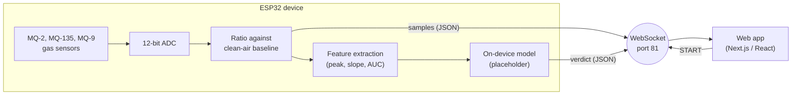

# AIRA Cloud: proof of concept

A proof of concept (PoC) of **AIRA**, a master's-level eHealth project on non-invasive lung screening from exhaled air. It combines a low-cost gas-sensor device based on an ESP32 with a web dashboard for health staff.

> **Scope and disclaimer**
>
> This repository validates **the architecture**: that a device of this kind can be built end to end with low-cost hardware (gas sensors, on-device inference, a real-time link to a web app, a clinical-style workflow).
>
> It does **not** validate any biomarker or molecule, the ability of these sensors to detect any disease, or any classification model. The model included here is a **placeholder** with hand-picked weights, not a trained or validated model. No clinical data was used. This is **not a medical device**, and its output must never be used for diagnosis or screening.

## Contents

- [About AIRA](#about-aira)
- [Architecture](#architecture)
- [Repository layout](#repository-layout)
- [Getting started](#getting-started)
- [Usage flow and operating modes](#usage-flow-and-operating-modes)
- [WebSocket protocol](#websocket-protocol)
- [The classification model](#the-classification-model)
- [Known limitations](#known-limitations)
- [Tech stack](#tech-stack)
- [Authors](#authors)
- [License](#license)

## About AIRA

AIRA explores whether volatile organic compounds (VOCs) in exhaled breath, measured with an array of inexpensive gas sensors and classified by a small machine-learning model running on the device itself, could one day support early-stage lung cancer screening in primary care settings such as pharmacies or health centres.

That goal needs clinical-grade sensors, real patient data and a validated model, none of which are part of this repository. What is published here is the engineering PoC: the pieces of the system and how they talk to each other.

## Architecture



1. **Device (ESP32).** Reads three MQ gas sensors, calibrates a clean-air baseline at startup, and when it receives `START` it records a 10 s window (100 samples at 10 Hz). Each sample is the ratio between the reading and the baseline, so values sit around 1.0 at rest. The samples are streamed live; at the end of the window the device extracts features, runs the model **on the device**, and sends the verdict.
2. **Link.** A plain WebSocket server on the ESP32 (port 81) sends JSON messages to the browser.
3. **Web app.** A Next.js single-page app that guides the operator through the workflow, plots the sensor curves in real time and displays the verdict computed by the device.

## Repository layout

```
app/                         Next.js app: page.tsx holds the workflow state and the WebSocket logic
components/aira/             Screens: mode selection, login, dashboard, consent, acquisition, analysis, verdict
components/ui/               shadcn/ui components (generated)
lib/classifier.ts            Verdict types, device message parsing, simulated device model (academic mode)
firmware/aira_streaming/     ESP32 firmware used by the web app (streaming + on-device verdict)
firmware/aira_sheets_logger/ Earlier standalone sketch that logs labeled test sessions to Google Sheets
```

## Getting started

### Web app

Requires Node.js 20.9 or later and [pnpm](https://pnpm.io).

```bash
pnpm install
pnpm dev
```

Open <http://localhost:3000>. **Academic mode** works with no hardware at all.

### Device (real mode)

1. **Wire the sensors.** Connect the analog output of each sensor module to the ESP32:

   | Sensor  | ESP32 pin |
   | ------- | --------- |
   | MQ-2    | GPIO 34   |
   | MQ-135  | GPIO 35   |
   | MQ-9    | GPIO 32   |

   The ESP32 ADC tolerates at most 3.3 V. Many MQ modules output up to 5 V, so check your module and add a voltage divider or adjust the load resistor if needed.

2. **Set up the Arduino IDE.** Install the ESP32 board package and the libraries `WebSockets_Generic` and `ArduinoJson`.

3. **Add your Wi-Fi credentials.** In `firmware/aira_streaming/`, copy `secrets.example.h` to `secrets.h` and fill it in. `secrets.h` is git-ignored.

4. **Flash and read the IP.** Upload `aira_streaming.ino`, open the serial monitor at 115200 baud and note the device IP address. Keep the sensors in clean air during the startup calibration.

5. **Point the web app at the device.** Copy `.env.example` to `.env.local` and set the IP:

   ```
   NEXT_PUBLIC_ESP32_IP=192.168.1.50
   ```

   Port and path are optional (`NEXT_PUBLIC_ESP32_WS_PORT`, default 81, and `NEXT_PUBLIC_ESP32_WS_PATH`, default `/`). Restart `pnpm dev` after changing them, since they are read at build time.

6. Run the web app **on a computer in the same network** as the device and choose *Modo Real*.

> **Note on HTTPS.** The ESP32 serves plain `ws://`. Browsers block that from pages served over HTTPS, so a deployment on a public HTTPS host (for example Vercel) cannot reach the device. Run the app locally over HTTP for real mode.

## Usage flow and operating modes

The interface is in Spanish, as it was designed for a Catalan/Spanish primary-care context.

1. Choose the operating mode.
2. Log in (a mock, see [limitations](#known-limitations)).
3. Enter the patient identifier (CIP).
4. Accept the patient consent.
5. Start the test. A 10 s countdown runs while the curves are drawn.
6. An analysis screen is shown, then the verdict.

| Mode | Data source | Verdict |
| ---- | ----------- | ------- |
| **Academic** (*Modo Académico*) | Simulated curves. Buttons let you choose a "healthy" or "risk" profile. | Computed in the browser by a simulated version of the device model (same features and weights as the firmware). |
| **Real** (*Modo Real*) | Live samples from the ESP32. | Computed on the ESP32 and sent to the app. If it does not arrive or is invalid, the result is shown as inconclusive. |

## WebSocket protocol

The device sends text frames with JSON, and the app sends plain-text commands.

**App to device**

| Message | Effect |
| ------- | ------ |
| `START` | Starts a 10 s acquisition. |
| `STOP`  | Sent when the app's countdown ends. The firmware ignores it because the stream already ends after 100 samples. |

**Device to app**

A sample, sent every 100 ms during the acquisition (a batch `{"data": [...]}` is also accepted):

```json
{ "time": 0.1, "mq2": 1.05, "mq135": 1.20, "mq9": 0.98 }
```

The verdict, sent once after the last sample:

```json
{
  "result": {
    "label": "risk",
    "scores": { "healthy": 0.03, "risk": 0.97 },
    "model": "Demo model (placeholder)",
    "placeholder": true
  }
}
```

`label` is `"healthy"` or `"risk"`. While `placeholder` is `true`, the verdict screen warns that the result has no clinical validity.

## The classification model

The firmware computes three features for each sensor over the window: the **peak ratio**, the **initial slope** (first 2 s) and the **area under the curve**. It then applies a small logistic regression.

The weights are hand-picked and were tuned only so the app's simulated "healthy" and "risk" profiles separate. They have no clinical meaning, and they are not suited to real sensor readings.

To plug in a model trained elsewhere (for example with [Edge Impulse](https://edgeimpulse.com), exported as an Arduino library), replace `classifyWindow()` in `firmware/aira_streaming/aira_streaming.ino`. The steps are documented in a comment above that function. Then set `MODEL_IS_PLACEHOLDER` to `false` so the app stops showing the demo warning. Academic mode keeps using the simulated model in `lib/classifier.ts`; keep its weights in sync with the firmware if you change the placeholder.

## Known limitations

- **Placeholder model.** No model has been trained or validated, and no biomarker has been tested. See the disclaimer above.
- **Mock login and workflow.** The login does not authenticate anyone, patient data is neither stored nor transmitted, and the buttons that send the report or refer the patient only show a confirmation message. There is no integration with any health information system.
- **Simulated curves.** Academic-mode data is synthetic and generated in code, not recorded.
- **Baseline.** The clean-air baseline is measured once at device startup, so it does not compensate for drift over time.
- **No automated tests.** The project has been checked by running it, not with a test suite, and `next.config.mjs` currently ignores TypeScript build errors.
- **Spanish only.** The interface text is in Spanish.

## Tech stack

- **Web app:** Next.js 16, React 19, TypeScript, Tailwind CSS 4, shadcn/ui, Recharts.
- **Firmware:** Arduino framework on ESP32, `WebSockets_Generic`.

## Authors

All the code in this repository was written by Eleonora Baracco.

The AIRA project itself was a concept developed with fellow students during a master's degree in eHealth. This proof of concept was built independently, as a side project, to explore how such a device could work in practice.

## License

Copyright (c) 2026 Eleonora Baracco. All rights reserved.

The source code is published for viewing and evaluation only. No permission is granted to use, copy, modify, distribute or build upon it without the author's written permission. See [LICENSE](LICENSE).
